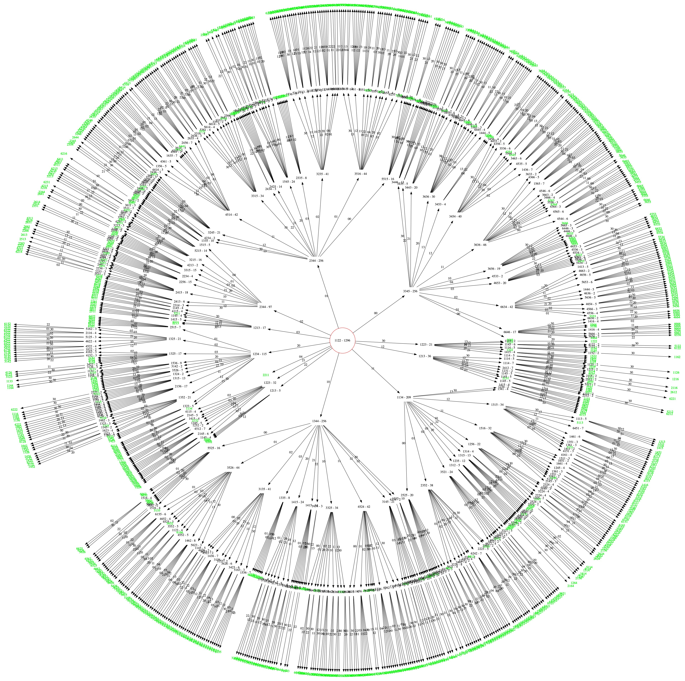

# Mastermind

Examples of how to score and play Mastermind games for APCS students using Java. This includes
a variety of scoring functions, and a few algorithms to play all games over various pin & color 
combinations.

This is meant for students to study the Mastermind problem further after they've completed thier
own assignments.

There's also some testing code: see TestGenerator to get a file of 1.6 million test cases, and
MastermindTester to use the file to test one or more student scoring algorithms.

